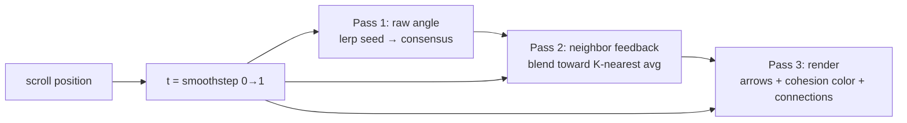

# Group Alignment animation rework + Phase B audit polish

## Overview

Two bodies of work in one plan.

**A. Group Alignment animation rework.** The p5.js sketch next to the "Group alignment" framework item runs scroll-driven, but reads too subtle. Rework it so it starts more visibly chaotic (arrows pointing in many directions), converges more dramatically as the reader scrolls, and adds a feedback-loop feel where arrows influence their neighbors on the way to consensus. More arrows or larger arrows. End state stays as it is: aligned.

**B. Phase B audit polish.** Carry forward the remaining P2/P3 items from `docs/plans/2026-04-16-001-refactor-impeccable-audit-fixes-plan.md` that Phase A deliberately deferred — touch targets, ring shadows, token polish, copy polish — plus the R-PAUSED-01 note for the paused `.phase-card` / `.belief-full` blocks.

The animation rework is the anchor; Phase B items ship opportunistically alongside.

## Problem Frame

The framework section on dxn.is exists to teach three conditions for strategy that holds up: group alignment, prioritized choices, tested bets. Each has a scroll-driven p5.js sketch that visualizes the idea.

For "Group alignment," the current sketch (named `hiddenMisalignment` in code) starts with arrows scattered at roughly ±108°, then interpolates toward a single direction as the reader scrolls. The animation works but lands soft: only 12 arrows, modest divergence, sequential connection lines that read more like a chain than a consensus. Brent wants it dialed up — more dramatic chaos at the top, richer feedback between arrows as alignment forms, clearer arrival at consensus.

The function name `hiddenMisalignment` also describes the opposite narrative from the current direction (divergent → aligned). The section's content frames facilitated alignment as the outcome; the code should match.

Separately, the Phase B audit polish items are low-risk and boring — touch-target sizing, one token rename, a few copy tweaks — but they move the `/impeccable` audit score from the Good band (16/20) toward the Excellent band (18-19/20) and clean up the last of the mechanical debt flagged in the original audit.

## Requirements Trace

**Animation rework:**
- R1. Arrows start visibly divergent at scroll t=0. Current ±108° widens to near full-circle spread (at least ±150°), or a biased spread toward cardinal directions that reads as "many people facing different ways."
- R2. Arrow count or size increases so the sketch reads as a substantive group, not a handful. Target: 18-24 desktop arrows (up from 12), 10-14 mobile (up from 6), OR keep count but increase arrow length 30-50%.
- R3. Animation exhibits a visible "feedback loop" — arrows influence each other's orientation as alignment forms. Not just a uniform lerp; cluster formation, cascading convergence, or neighbor-pull should be visible between t=0.3 and t=0.8.
- R4. End state (t=1) stays as currently shipped: all arrows aligned on a single direction with connection lines forming a cohesive network.
- R5. Scroll is fully reversible. Scrolling up restores earlier divergent state. No accumulated physics state that breaks on rewind.
- R6. Reduced-motion users see the static t=1 end state (all arrows aligned, full connection network rendered once on paint, no scroll-driven updates). Matches the "render at t=1 on first paint, skip scroll-driven redraws" pattern Unit 1 Approach specifies.
- R7. The function name matches the component narrative. Rename `hiddenMisalignment` to `groupAlignment` (and update the header comment accordingly).

**Phase B audit polish** (carry-forward from `docs/plans/2026-04-16-001-refactor-impeccable-audit-fixes-plan.md`):
- R8. Touch targets on carousel prev/next, indicator dots, carousel-pause, nav-toggle, theme-toggle reach 44x44 minimum (R-A11Y-04, R-RESP-01).
- R9. State-aware aria-labels on carousel-pause (R-A11Y-07). Nav-toggle already done inline.
- R10. Ring-shadow layer removed from carousel controls (R-ANTI-03).
- R11. `backdrop-filter: blur(8px)` removed from `.carousel-btn` (R-PERF-05).
- R12. Smooth scroll gated on `prefers-reduced-motion: no-preference` (R-PERF-04).
- R13. Scrolled-header background moved to `--color-header-scrolled` token per theme (R-THEME-03).
- R14. `--font-accent` renamed to `--font-quote` and documented in DESIGN.md §3 (R-THEME-04).
- R15. Hero min-height adjusted for landscape mobile (R-RESP-02).
- R16. Copy polish: newsletter tagline/description de-dup (R-COPY-05), contact form labels warm register (R-COPY-06), contact form + calendly header/button verb alignment (R-COPY-07/08), theme-toggle `title` dropped (R-COPY-09 — done during Phase A, verify only), service kicker rewrites per Brent source (R-COPY-11), footer tagline rework (R-COPY-12), newsletter logo alt comment (R-COPY-14).

**Documentation:**
- R17. R-PAUSED-01 flag retained in the original plan. This plan adds a pointer so future resurrection of `.phase-card` / `.belief-full` sees the warning.

## Scope Boundaries

- No redesign of the other two framework sketches (`plansWithoutChoices`, `untestedAssumptions`). Those stay as-is.
- No changes to the framework section's HTML structure, copy, or layout. Only `js/framework-visuals.js` changes for the animation rework.
- No physics engine (Matter.js, Toxiclibs). The sketch stays pure p5.js using the existing scroll-driven timeline pattern.
- No hero h1 flip (R-COPY-13 optional; deferred again unless Brent raises it).
- No implementation of the R-PAUSED-01 fix for `.phase-card` / `.belief-full`. Those stay dormant; this plan only adds a forward-pointer.

### Deferred to Separate Tasks

- R-COPY-02 (Service 1 tools), R-COPY-04 (service-panel link verbs): withdrawn in origin plan. Not addressed.
- R-COPY-13 (hero h1 first-person flip): optional, deferred to a future pass.
- Resurrection work for `.phase-card` and `.belief-full`: Brent's separate initiative. R-PAUSED-01 will surface in that plan, not this one.

## Context & Research

### Relevant Code and Patterns

- `js/framework-visuals.js` — host file for the animation rework. The `hiddenMisalignment` function (definition at line 60, body through line 171; preceding comment header at lines 57-59) is the direct target. Renaming it to `groupAlignment` also updates the `manageVisibility` dispatch call at the bottom of the file.
- `js/service-visuals.js` — sister file for service-section sketches. Uses the same `scroll-as-timeline` pattern: `getFrameworkProgress(index)` returns 0-1, each draw pass smoothstep-eases with `t = prog * prog * (3 - 2 * prog)`. Confirms the convention.
- `getFrameworkProgress()` helper (framework-visuals.js:25-34) — reads the framework item's viewport position and returns a 0-1 progress value. Shared by all three framework sketches. No changes needed.
- `manageVisibility()` helper (framework-visuals.js:40-55) — IntersectionObserver pattern that instantiates a sketch when its container enters viewport and destroys it on exit. Performance pattern to preserve.
- `css/styles.css` — houses the Phase B CSS polish targets. Specific line ranges documented in the origin plan per-requirement.
- `css/dsl-tokens.css` — extended in Phase A with alpha/tint tokens. Phase B adds `--color-header-scrolled` per theme and renames `--font-accent` to `--font-quote`.
- `index.html` — carries the copy polish edits and the nav/carousel button label state changes.
- `js/main.js` — nav-toggle state labels already land in Phase A. Carousel-pause state labels land in this plan's Unit 7.
- `DESIGN.md` — §1 Visual Theme & Atmosphere names the three framework sketches as a signature move (preserve). §3 Typography Rules documents the font roles. §8 Responsive Behavior mentions the 40x40 nav/theme toggles as "slightly under spec, review in next pass" — this plan addresses that.

### Institutional Learnings

- No `docs/solutions/` directory in this repo. No prior p5.js-sketch institutional writeup to pull from.
- The existing plan's System-Wide Impact section already ruled out cross-layer regressions. That analysis still holds for the current scope.

### External References

- Nature of Code (loaded via `/nature-of-code` skill): Reynolds' steering — alignment behavior steers each agent toward the average velocity of its neighbors. Formula: `steering = desired - current`, limited by `maxforce`. Chapter 5. This is the vocabulary for the feedback-loop mechanic.
- Frontend Design (loaded via `/frontend-design` skill): "high-impact moments" principle — one well-orchestrated scroll moment with cascading reveals creates more delight than scattered micro-interactions. The Group Alignment sketch is exactly this kind of moment; dial it up.

## Key Technical Decisions

- **Keep the sketch scroll-reversible by computing per-frame from `t`, not accumulating state.** The existing sketch does this (pure `lerp(trueAngle, alignedAngle, t)`). The rework preserves this property. Feedback-loop feel comes from deterministic per-frame computation that references neighbor angles at that same `t`, not from accumulated angular velocity. A real flocking simulation would break reversibility; that tradeoff is not worth it.

- **Widen initial divergence to biased cardinal spread rather than uniform 360°.** Uniform randomness reads as noise. Biasing each arrow's initial angle toward one of four cardinal directions (N/E/S/W) with some per-arrow jitter reads as "different camps" — which is closer to the actual organizational phenomenon (sub-groups with competing views) than pure chaos. Target: each arrow's `seedAngle = cardinal + gaussian(0, 0.4)`, cardinal chosen per-arrow from `[-PI/2, 0, PI/2, PI]`.

- **Feedback loop mechanic: neighbor-weighted angle with progress-modulated blend.** At each frame, compute each arrow's displayed angle as: `blend(seedAngle, neighborAvg, consensusAngle, t)`. At `t=0`: pure seed. `0 < t < 0.6`: seed + neighbor pull dominant (cluster formation). `0.6 < t < 1`: neighbor pull fades, consensus pull dominates (global convergence). Arrows near already-aligning clusters turn faster than isolated ones — the visible feedback loop. Edge arrows on the grid have fewer neighbors (2 instead of 3); accept this as a subtle visual asymmetry that reads as edges "leading" or "lagging," not as a bug to correct.

- **Preserve arrow visual style (signature move).** DESIGN.md §1 names the three framework sketches as signature moves. The rework changes count, seed distribution, and feedback mechanic, but preserves the visual identity of each arrow: current stroke weight ranges (1.8-2.8 desktop, 2.0-3.0 mobile), arrowhead proportion (10px desktop, 8px mobile), line-cap defaults, and dim→gold color transition all stay. Length range stays (28-42 desktop, 22-32 mobile). If 20 arrows at current sizing crowds the mobile canvas at 600px-wide, reduce `arrowLenMax` to 28 first; do not change weight or head size.

- **Light-theme color behavior.** Existing `gold()`, `coral()`, `teal()`, `dim()`, `bg()` helpers at the top of `framework-visuals.js` already return theme-appropriate values (e.g., `gold()` returns `[251, 226, 72]` in dark, `[201, 181, 10]` in light). The rework uses these helpers unchanged. Connection lines in light theme use `gold()` at current low-opacity levels, which render legibly against the `#FAFAF8` background because the light-theme gold is already darkened. Verify connection-line opacity reads at a spot-check on light mode before committing.

- **Arrow count bump: 20 desktop, 12 mobile.** Lands in Brent's "more arrows" ask without overwhelming the canvas. Existing counts were 12/6. Arrow size stays in the current range (28-42px desktop, 22-32px mobile) since more arrows at current size reads fuller than fewer-bigger.

- **Connection lines evolve with alignment, not just threshold.** Current code draws sequential arrow-i to arrow-i+1 lines after t=0.5. New: draw lines between each arrow and its 2-3 nearest neighbors whose angles differ by less than a progress-modulated threshold. At `t=0.5`, lines appear only between near-aligned pairs. At `t=1`, lines connect the whole field. The lines visualize the feedback network.

- **Rename `hiddenMisalignment` → `groupAlignment`.** Updates the dispatch at the bottom of `framework-visuals.js` and the header comment. The narrative of the sketch (divergent → aligned) now matches both the section heading and the function name.

- **Phase B items ship as small separate commits.** They do not depend on each other or on the animation rework. Treat each Phase B unit as a standalone commit so the animation rework is easy to isolate in git history.

## Open Questions

### Resolved During Planning

- **Direction of animation (convergent vs divergent over time):** Confirmed during Phase A and now re-confirmed by Brent. Divergent at t=0 → aligned at t=1. Matches the section heading "Group alignment" and the copy narrative (facilitation creates alignment).
- **Arrow count target:** 20 desktop / 12 mobile. Named in the Key Technical Decisions.
- **Feedback loop approach:** Neighbor-weighted angle blend (not flocking physics). Preserves scroll-reversibility. Named in the Key Technical Decisions.
- **Function rename:** Yes, `hiddenMisalignment` → `groupAlignment` per R7.

### Deferred to Implementation

- **Exact neighbor-weight formula.** The plan specifies the shape (seed + neighbor-avg + consensus, blended by t). Final weights (e.g., neighbor pull peak at t=0.6 with weight 0.6, consensus pull ramping from 0 to 0.8 across t=0.5-1.0) lands when the animation runs and Brent signs off on the feel. This is a creative knob that belongs at implementation, not plan.
- **"Near-aligned" threshold for connection lines.** Starts at ~0.3 radians (~17°), tightens as t increases. Exact curve lands at implementation.
- **Arrow size adjustment on mobile if 12 arrows feels cramped.** May need to reduce `arrowLenMax` slightly. Decide at implementation after spot-checking mobile viewport.
- **R-COPY-11 service kicker text.** Brent supplies the moment-specific copy during Unit 9. Draft options exist in the origin plan.
- **R-COPY-07/08 button verb picks.** Brent picks between "Send it" / "Send" / "Send Message" (contact form) and "Book a Call" / "Book" (calendly) at implementation.

## High-Level Technical Design

> *This illustrates the intended approach and is directional guidance for review, not implementation specification. The implementing agent should treat it as context, not code to reproduce.*

The Group Alignment animation per-frame, as pseudo-code:

```
per-frame draw(t = smoothstep(scrollProgress)):
  pass 1: compute each arrow's raw angle
    for each arrow i:
      seed = arrow[i].seedAngle              // cardinal + gaussian jitter, fixed at setup
      target = baseAngle                     // the consensus direction
      rawAngle[i] = lerp(seed, target, easeCurve(t))

  pass 2: apply neighbor feedback
    for each arrow i:
      neighbors = nearest K arrows by grid position (K = 2-3)
      neighborAvg = circular mean of rawAngle[neighbors]
      feedbackWeight = bump(t)               // peaks around t=0.6, tapers at 0 and 1
      displayAngle[i] = lerp(rawAngle[i], neighborAvg, feedbackWeight)

  pass 3: render
    for each arrow i:
      draw arrow at (arrow[i].x, arrow[i].y) with angle displayAngle[i]
      color lerps dim → gold as cohesion increases
    for each arrow i:
      find 2-3 nearest neighbors with |displayAngle diff| < threshold(t)
      draw faint gold connection line
```

Key properties this shape guarantees:
- Stateless per-frame: displayAngle[i] depends only on t and fixed setup values. Scroll-reversible.
- Feedback loop visible: pass 2 makes each arrow's displayed angle depend on its neighbors' computed angles at the same t. Clusters form because arrows pull each other toward local consensus before global consensus takes over.
- Brent's ask satisfied: wider initial spread via cardinal-biased seed (vs current ±108° uniform), peer-pull dynamic mid-scroll, same aligned end state as today.

Mermaid diagram of the three-pass shape:



## Implementation Units

- [ ] **Unit 1: Group Alignment animation rework**

**Goal:** Rework the `hiddenMisalignment` sketch into a more visibly dramatic "Group alignment" animation with wider initial divergence, more arrows, and a neighbor-feedback mechanic that produces visible cluster formation and cascading convergence. Rename the function to match the narrative.

**Requirements:** R1, R2, R3, R4, R5, R6, R7

**Dependencies:** None

**Files:**
- Modify: `js/framework-visuals.js` (rework `hiddenMisalignment` → `groupAlignment`, update dispatch at bottom of file, update header block comment at top of file)

**Approach:**
- Rename the function. Update the dispatch call and the header block comment describing the three sketches.
- Setup phase:
  - ARROW_COUNT: 20 desktop, 12 mobile (up from 12/6).
  - Grid columns: 5 desktop, 4 mobile (up from 4/3) to spread more arrows evenly.
  - Per-arrow `seedAngle`: pick a cardinal direction from `[-HALF_PI, 0, HALF_PI, PI]` (one of N/E/S/W), then add `randomGaussian(0, 0.4)` jitter. Produces a more organized-looking initial chaos (sub-groups facing different ways) rather than pure random noise.
  - Keep per-arrow `len` and `weight` sizing in current ranges unless implementation reveals the canvas feels empty.
  - Drop the `trueAngle` / `alignedAngle` fields and the `lerp(trueAngle, alignedAngle, t)` approach. Replace with the three-pass computation in the High-Level Technical Design.
- Draw phase:
  - Pass 1: compute `rawAngle[i]` per arrow as an eased lerp from `seedAngle` to `baseAngle` (the consensus direction, still `-HALF_PI`).
  - Pass 2: for each arrow, find its 2-3 nearest neighbors by grid index (not by euclidean distance — faster and deterministic). Compute circular mean of their raw angles. Blend the arrow's displayed angle toward that mean by a weight that peaks at t≈0.6 and tapers at 0 and 1 (e.g., `4 * t * (1 - t)` gives a bell curve with peak 1 at t=0.5; scale by 0.5-0.7 for subtle influence).
  - Pass 3: render arrows with color lerp (dim → gold based on t and per-arrow cohesion), render connection lines between arrows whose displayed angles differ by less than a t-dependent threshold. Threshold starts wide (~0.8 rad) and tightens as t increases, so lines appear more numerous and more spread as alignment forms.
- Circular mean implementation: compute `atan2(sum(sin(θ)), sum(cos(θ)))` over neighbor angles. Standard trick to average angles without wrap-around bugs.
- Preserve existing patterns: `frameRate(24)`, `_lastT1` scroll-idle skip (adjust debounce threshold if neighbor-feedback makes small t changes visible), color helpers (`gold()`, `dim()`), `manageVisibility` IntersectionObserver pattern.
- Reduced-motion: if `prefers-reduced-motion: reduce`, skip the animation and render the t=1 end state statically (all arrows aligned, full connection network). Same degradation pattern as other framework sketches.

**Execution note:** Implement incrementally and preview on the feature branch after each pass. Pass 1 rework (seed angle + eased lerp) is the minimum viable change; Brent can sign off on the new feel before layering in pass 2 (neighbor feedback) and the connection-line evolution. If pass 2 makes the animation feel too busy, fall back to pass 1 + existing connection behavior.

**Technical design:** See the High-Level Technical Design section above.

**Patterns to follow:**
- `plansWithoutChoices` (framework-visuals.js:177-onwards) for the multi-tile + progress-modulated intensity pattern.
- `service-visuals.js` sketches for confirmed scroll-driven timeline conventions.
- Nature of Code Ch 5 alignment steering (conceptual reference for the neighbor-pull mechanic; the code is stateless, not a Reynolds-style steering simulator).

**Test scenarios:**
- Happy path: scroll from before the framework item to below it. At t=0, arrows visibly face different directions (cardinal spread with jitter, not uniform). At t=0.5, arrows begin clustering toward neighbors; connection lines appear between near-aligned pairs. At t=1, all arrows point up (baseAngle), full connection network visible.
- Edge case: scroll backward (up). Animation reverses smoothly. No accumulated state, no flicker.
- Edge case: resize the viewport from desktop to mobile and back. Canvas rebuilds via `windowResized`, arrow count adjusts.
- Edge case: user has `prefers-reduced-motion: reduce`. Sketch renders the aligned end state statically on first paint; no scroll-driven changes.
- Edge case: system is dark mode, user toggles to light. Color helpers return light-theme values; next draw frame uses them. (Existing behavior, verify it still holds.)
- Edge case: scroll past the framework section, framework item leaves viewport. IntersectionObserver removes the sketch and canvas. Scroll back, sketch re-instantiates with fresh state.
- Integration: spot-check on the preview URL with Brent before merging. Animation feel is a subjective call; Brent signs off on whether the rework hits the "dial up" target.

**Verification:**
- At t=0, at least 70% of arrows face non-vertical directions (verifies wide initial spread).
- At t≈0.5, multiple visible clusters (groups of 3-5 arrows at similar angles) exist before global alignment completes.
- At t=1, all arrows within 5° of baseAngle. Connection network spans the full canvas.
- Scrolling reverses smoothly with no flicker or dropped frames.
- Brent confirms the animation reads as "dialed up" — more dramatic chaos, visible feedback, decisive arrival.

**Brent sign-off fallback:** if Brent is unavailable when the implementer is ready to merge, ship pass 1 only (wider seed + eased lerp) to the preview URL, hold pass 2 (neighbor feedback) on the feature branch. Async-notify Brent with the preview link. Do not merge to main without his sign-off — the animation sits on a signature framework-section sketch, and guessing on subjective feel is the exact failure mode the rest of this plan is trying to avoid.

- [ ] **Unit 2: Touch targets to 44x44**

**Goal:** Bring all interactive controls to WCAG 2.5.5 minimum tap area. Wrap the 10-12px visual dots in 44x44 padding; bump other controls directly.

**Requirements:** R8

**Dependencies:** None

**Files:**
- Modify: `css/styles.css` (carousel-btn desktop + mobile, indicator-dot, carousel-pause, nav-toggle, theme-toggle, services-dot visual-only span — padding approach)

**Approach:**
- `.carousel-btn` mobile override at ~line 3325: raise from 36x36 to 44x44.
- `.carousel-btn` desktop at ~line 2285: already 48x48, no change.
- `.indicator-dot` at ~line 2316: keep 12x12 visual. Wrap hit area by removing from flex-sizing context and using an `::after` pseudo-element absolutely positioned at `inset: -16px` to create a 44x44 click target without inflating the laid-out footprint. Alternate: add padding and compensate by reducing the parent `.carousel-indicators { gap }` — pick whichever reads cleaner at implementation.
- `.carousel-pause` at ~line 2342: raise from 36x36 to 44x44.
- `.nav-toggle` at ~line 394: raise from 40x40 to 44x44.
- `.theme-toggle` at ~line 513: raise from 40x40 to 44x44.

**Patterns to follow:**
- Existing WCAG-aware focus ring pattern (`:focus-visible` with `:focus:not(:focus-visible)` fallback landed in Phase A) — verify touch-target changes don't regress focus indicator placement.

**Test scenarios:**
- Happy path: on Chrome DevTools mobile emulation, tap each interactive control. Inspect the clicked element's bounding rect — measures ≥44x44.
- Edge case: resize window from desktop to mobile across the 768px breakpoint. Dots and buttons stay tappable without layout shift.
- Edge case: indicator dot row stays visually centered after the pseudo-element tap-area addition — no accidental left-shift from the expanded footprint.
- Integration: Chrome Lighthouse Accessibility audit reports no failing touch-target findings.

**Verification:**
- All interactive controls on the page measure ≥44x44 hit area via DevTools element inspector.
- Indicator dot cluster visually unchanged at any viewport size.
- Lighthouse accessibility score ≥95 for the homepage.

- [ ] **Unit 3: Drop ring shadows and backdrop-filter from carousel controls**

**Goal:** Remove the six `box-shadow: 0 0 0 Npx rgba(...)` ring-shadow declarations on carousel-btn and indicator-dot, and drop `backdrop-filter: blur(8px)` from `.carousel-btn`. Tones down templated feel and removes a GPU layer cost.

**Requirements:** R10, R11

**Dependencies:** None

**Files:**
- Modify: `css/styles.css` (carousel-btn base, hover, indicator-dot.active, light-theme variants at lines 124/130/138)

**Approach:**
- Remove `box-shadow: 0 0 0 Npx rgba(...)` declarations on `.carousel-btn` (~line 2294), `.carousel-btn:hover` (~line 2301), `.indicator-dot.active` (~line 2347), and the light-theme variants at lines 124, 130, 138.
- Remove `backdrop-filter: blur(8px)` from `.carousel-btn` (~line 2293).
- Form input focus rings at `css/styles.css:150` and `2927` stay (functional affordance, not decoration).
- Button keeps its gold-tinted background and border; the ring-shadow does not add meaningful signal on top of that.

**Patterns to follow:**
- Existing `.btn:hover` pattern (no ring-shadow layer) as the target aesthetic.

**Test scenarios:**
- Happy path: hover carousel prev/next on desktop. Background and border shift; no coral ring surrounds the button.
- Happy path: toggle between active and inactive indicator dots. Color shifts; no ring around the active dot.
- Edge case: hover in light theme specifically — the light-theme rings at lines 124/130/138 also need to go.
- Edge case: test with a backdrop image or bloom behind the button on desktop. Without `backdrop-filter`, the button reads cleanly against the warm background.
- Test expectation: no behavioral change. This is visual.

**Verification:**
- `grep` for `box-shadow: 0 0 0` in `css/styles.css` returns only form-input focus matches (lines 150, 2927) or inline-comment mentions.
- `grep` for `backdrop-filter` returns only the site-header scrolled rule (lines 321-322).
- Visual pass in both themes: carousel controls read cleaner and less templated.

- [ ] **Unit 4: Motion-gated smooth scroll + state-aware carousel-pause label**

**Goal:** Wrap `scroll-behavior: smooth` in a `prefers-reduced-motion: no-preference` media query and wire state-aware `aria-label` toggling for the carousel-pause button.

**Grouping rationale:** Both items touch accessibility signals for motion — smooth-scroll gating honors system-level reduced-motion preference, and the carousel-pause state-aware label announces the active motion state to screen readers. They share a motion-a11y theme and land together in a small commit. (Origin plan 2026-04-16-001 grouped both inside a single Unit 7; this plan keeps the grouping for the same reason.)

**Requirements:** R9, R12

**Dependencies:** None

**Files:**
- Modify: `css/styles.css` (html rule at ~line 196)
- Modify: `js/main.js` (carousel-pause click handler)
- Modify: `index.html` (carousel-pause initial aria-label at ~line 556)

**Approach:**
- Wrap `html { scroll-behavior: smooth }` in `@media (prefers-reduced-motion: no-preference)` OR move it into the existing reduced-motion handler as an `auto` override.
- In `index.html` at ~line 556, change initial `aria-label="Pause auto-rotation"` to `aria-label="Pause testimonial rotation"`.
- In `js/main.js`, locate the carousel-pause click handler. When paused, set `aria-label="Resume testimonial rotation"`. When resumed, set `aria-label="Pause testimonial rotation"`. Mirror the nav-toggle pattern that Phase A landed.

**Patterns to follow:**
- Existing `prefers-reduced-motion` handlers at `css/styles.css:673, 917, 1464, 2553`.
- Nav-toggle state-aware aria-label logic in `js/main.js` from Phase A.

**Test scenarios:**
- Happy path: system preference = default. Click an anchor link. Smooth scroll works.
- Happy path: system preference = reduced. Click an anchor link. Page jumps instantly, no smooth scroll.
- Happy path: VoiceOver on. Pause the testimonial rotation. Screen reader announces "Resume testimonial rotation" on the button. Resume. Hears "Pause testimonial rotation."
- Edge case: toggle pause rapidly. aria-label updates don't lag behind visible icon state.

**Verification:**
- `prefers-reduced-motion: reduce` in Chrome DevTools Rendering → Emulate CSS media feature causes anchor-link clicks to jump without smooth scroll.
- VoiceOver reads correct state-aware label on pause button toggle.

- [ ] **Unit 5: Scrolled-header background as a token**

**Goal:** Move the `rgba(0, 0, 0, 0.95)` / `rgba(250, 250, 250, 0.95)` scrolled-header backgrounds to a per-theme `--color-header-scrolled` token. Eliminates one of the last orphan rgba literals and makes theme toggling cleaner.

**Requirements:** R13

**Dependencies:** None

**Files:**
- Modify: `css/dsl-tokens.css` (add `--color-header-scrolled` to both theme blocks)
- Modify: `css/styles.css` (replace literal at ~line 323 and light-theme override at ~line 30)

**Approach:**
- In `css/dsl-tokens.css` dark block: `--color-header-scrolled: rgba(0, 0, 0, 0.95);`
- In `css/dsl-tokens.css` light block: `--color-header-scrolled: rgba(250, 250, 250, 0.95);`
- In `css/styles.css:323` (default `.site-header.scrolled`): `background-color: var(--color-header-scrolled);`
- In `css/styles.css:44-47` (`[data-theme="light"] .site-header.scrolled`): remove only the `background-color` declaration. Keep the `border-bottom: 1px solid rgba(0, 0, 0, 0.08);` declaration in place. The token-per-theme handles background; the light-theme border-bottom is a separate concern the token rename does not touch.
- Run `node scripts/sync-design-md.mjs` after the change to re-flow DESIGN.md's color tables.

**Patterns to follow:**
- Phase A's alpha/tint token additions in `css/dsl-tokens.css` — same insertion location, same per-theme structure.

**Test scenarios:**
- Happy path: scroll past the hero. Header fills with theme-appropriate background.
- Happy path: while scrolled, toggle theme. Background shifts cleanly; no flash or overlay persisting.
- Edge case: `grep` `css/styles.css` for `rgba(0,\s*0,\s*0,\s*0\.95)` returns zero hits.

**Verification:**
- Token exists in both theme blocks in `css/dsl-tokens.css`.
- Live site scroll-past-hero works in both themes without visible flicker on theme toggle.

- [ ] **Unit 6: Rename --font-accent to --font-quote, document in DESIGN.md**

**Goal:** Rename the undocumented `--font-accent` alias to `--font-quote` and add it to DESIGN.md §3 as a fourth semantic role. Sweep cross-repo references.

**Requirements:** R14

**Dependencies:** None

**Files:**
- Modify: `css/styles.css` (alias declaration at ~line 19, use sites at ~line 2210 and 2583)
- Modify: `DESIGN.md` (§3 Typography Rules table)
- Verify: `agents/index.html`, `sketch-gallery.html`, `index.html` inline styles, `css/dsl-tokens.css` — grep for any remaining `--font-accent` reference

**Approach:**
- In `css/styles.css:34`, rename `--font-accent: var(--font-serif);` to `--font-quote: var(--font-serif);`.
- Update use sites at `css/styles.css:2241` (`.testimonial p` font-family) and `css/styles.css:2614` (`.statement-quote p` font-family) from `var(--font-accent)` to `var(--font-quote)`.
- Grep the full repo for any remaining `--font-accent`. Replace everything found, or document intentional hold-outs.
- In `DESIGN.md` §3 Font families table, add a fourth row: `| Quote accent | `--font-quote` (aliased to Fraunces) | for testimonial pull-quotes and the Wheatley statement quote |`. Or extend existing Fraunces row to mention the alias.

**Patterns to follow:**
- None — simple token rename.

**Test scenarios:**
- Happy path: load the homepage. Testimonial quotes and statement quote render in Fraunces italic.
- Edge case: `grep -r "font-accent"` across the repo returns zero hits (or intentional documented ones).
- Test expectation: no behavioral change. Visual parity required.

**Verification:**
- Token rename complete across all files.
- Testimonial and statement quotes look identical to pre-rename.

- [ ] **Unit 7: Hero min-height for small landscape**

**Goal:** Replace `.hero { min-height: 60vh }` with a clamp that prevents clipping on landscape mobile without squeezing content on large viewports.

**Requirements:** R15

**Dependencies:** None

**Files:**
- Modify: `css/styles.css` (`.hero { min-height }` at ~line 599)

**Approach:**
- Replace `min-height: 60vh;` with `min-height: clamp(520px, 70vh, 900px);`. OR drop `min-height` entirely on mobile and let content flow.
- Pick at implementation after spot-checking iPhone SE landscape (375x667).

**Patterns to follow:**
- Existing `clamp()` usage in type scale (`css/styles.css` hero-kinetic font-size) for precedent on the three-arg pattern.

**Test scenarios:**
- Happy path: iPhone SE portrait (375x667). Hero fills viewport as before.
- Happy path: iPhone SE landscape (667x375). Hero content fits without clipping; ghost text and CTAs visible.
- Happy path: desktop 1440x900. Hero height feels right, not artificially tall.
- Edge case: foldable devices with unusual aspect ratios. Hero degrades to natural content height.

**Verification:**
- Hero renders correctly on iPhone SE landscape without clipping.
- Desktop hero proportions unchanged.

- [ ] **Unit 8: Copy polish (newsletter, contact, calendly, theme-toggle, footer)**

**Goal:** Ship the mechanical P2/P3 copy items in one pass: newsletter tagline/description de-dup, contact form label register, verb alignment, theme-toggle title drop verification, footer tagline rework, newsletter logo alt comment.

**Requirements:** R16

**Dependencies:** None

**Files:**
- Modify: `index.html` (newsletter section, contact form, calendly section, footer, newsletter logo img, theme-toggle verify)

**Approach:**
- Newsletter tagline (~line 638) → "Weekly, for credit union leaders."
- Newsletter description (~line 641, Draft A default from origin plan) → "Curated agentic AI developments with a point of view."
- Contact form labels (~lines 686, 692, 698, 704): "Your Name *" → "Your name *" / "Email Address *" → "Your email *" / "Organization" → "Where you work" / "What's on your mind? *" unchanged.
- Contact form button (~line 709): "Send Message" → "Send it" OR "Send" — Brent picks.
- Calendly section (~lines 715-717): keep "Book a Call" h3. Button "Schedule a Call" → "Book a Call" OR "Book" — Brent picks. Intro "Prefer to schedule a time to talk? Pick a 30-minute slot." → "Prefer to pick a slot yourself? Grab 30 minutes."
- Theme-toggle (index.html:274): remove `title="Toggle theme"` attribute. Phase A did NOT land this — verified against current file state. Keep `aria-label="Toggle dark/light mode"`.
- Footer tagline (~line 735): "Built with ❤️ for humans and agents." → "A site for humans and agents." The link on "agents" still routes to `/agents/`; emoji removed.
- Newsletter logo img (~line 635): keep `alt=""`. Add inline HTML comment above: `<!-- decorative: 'AI for FIs' text sits adjacent -->`.

**Execution note:** Run all drafts through the `writing-quality` checklist before commit. No em dashes, no banned phrases, no tricolon default, no false singulars.

**Patterns to follow:**
- Service 3 body copy (`index.html:402`) as the voice benchmark — first-person, specific, warm.
- llms.txt's conversational tone as secondary reference.

**Test scenarios:**
- Happy path: read newsletter section in the browser. Tagline and description say different things.
- Happy path: read contact form. Labels feel consistent in register.
- Happy path: read calendly section. Header verb matches button verb.
- Happy path: read footer. No emoji, no ambiguous "Built," link to agents page still works.
- Test expectation: no behavioral change. Form submission, calendly button, agents link all continue to work.

**Verification:**
- Each copy item reads once, no redundancy.
- All links still resolve correctly.
- Brent signs off on final button verbs for contact + calendly.

- [ ] **Unit 9: Service kicker rewrites (conditional)**

**Collapse-into-Unit-8 option:** Unit 9 is a content-blocked unit whose default execution path is no-op (keep existing kickers). A scope-guardian review flagged that this could collapse into Unit 8 as a conditional sub-task. Kept as a separate unit here because kicker rewrites require Brent's source input and a voice pass (`brent-voice` + `writing-quality`) that is materially different from the mechanical label swaps in Unit 8. If Unit 8 ships and kickers have not arrived, leave Unit 9 open on the task list rather than folding it into the Unit 8 commit.

**Goal:** Replace the three current service kickers with moment-specific text that describes when each service is right, not the generic audience label.

**Requirements:** R16 (R-COPY-11 specifically)

**Dependencies:** None — but blocks on Brent supplying source text.

**Files:**
- Modify: `index.html` (service kickers at ~lines 335, 368, 400)

**Approach:**
- Current kickers (for reference):
  - Service 1: "For leadership teams at a crossroads"
  - Service 2: "For boards, staff, and industry audiences"
  - Service 3: "For CEOs and C-suite leaders"
- Draft options from origin plan (Brent picks or supplies alternates):
  - Service 1: "When annual planning isn't landing" / "When the strategy needs to hold up against AI" / "Before a merger, a transition, or a reset"
  - Service 2: keep as-is (audience framing works here — boards + staff + industry is the real segmentation)
  - Service 3: "For decisions you can't think through alone" / "For the space between board meetings" / "When the calendar is full and the thinking isn't"
- Default if Brent defers at implementation time: ship Unit 9 without changes. Not a blocker.

**Execution note:** This unit depends on Brent's source. If Brent has not supplied kickers by the time Unit 8 (copy polish) ships, skip this unit and leave the existing kickers in place. Log the skip in the commit for Unit 8 or in PROJECT_STATUS.md so it doesn't get forgotten.

**Patterns to follow:**
- Service 3 body copy for specificity benchmark.

**Test scenarios:**
- Happy path: read each service panel. Kicker describes a moment or trigger, not a generic audience.
- Test expectation: no behavioral change. Pure copy edit.

**Verification:**
- Brent approves the selected kickers.
- No layout regression (kickers stay on their existing lines).

- [ ] **Unit 10: PROJECT_STATUS.md update + R-PAUSED-01 pointer**

**Goal:** Log the Group Alignment rework and Phase B completion in PROJECT_STATUS.md. Add a pointer to the R-PAUSED-01 flag so future `.phase-card` / `.belief-full` resurrection work knows to handle the BAN 1 pattern.

**Requirements:** R17

**Dependencies:** Units 1-9 complete

**Files:**
- Modify: `PROJECT_STATUS.md` (use Edit, not Write, per `~/.claude/rules/project-status-safety.md`)

**Approach:**
- Append a new section under "Recent Changes" summarizing what shipped: Group Alignment animation rework (one-sentence framing), Phase B audit polish (list the R-ids, one line each).
- In "What's Left," add a new bullet with this exact shape: "When the paused `.phase-card` and `.belief-full` blocks come back, they must not ship with the colored `border-left: 3px` pattern retired from the active site in Phase A. See R-PAUSED-01 in [docs/plans/2026-04-16-001-refactor-impeccable-audit-fixes-plan.md](docs/plans/2026-04-16-001-refactor-impeccable-audit-fixes-plan.md#R-PAUSED-01) for the replacement mechanic."
- Use the `Edit` tool, not `Write`, per `~/.claude/rules/project-status-safety.md`.
- Keep the status line ≤120 characters per the safety rule.

**Test scenarios:**
- Test expectation: pure doc update, no behavior.

**Verification:**
- PROJECT_STATUS.md builds correctly (readable markdown, no formatting breaks).
- R-PAUSED-01 pointer present in "What's Left".

## System-Wide Impact

- **Interaction graph:** Unit 1 touches `js/framework-visuals.js` only. No cross-file JS dependencies. The framework sketches are independent of service visuals, hero particles, or nav logic.
- **Error propagation:** If Unit 1 implementation hits a runtime error, the IntersectionObserver/`manageVisibility` pattern will still run — it just won't produce a visible animation. Worst case: blank canvas in the framework-visual div, which is an `aria-hidden="true"` decorative element. No cascade into page interactivity.
- **State lifecycle risks:** Unit 1's stateless-per-frame design eliminates accumulated-state bugs. Scroll reversibility is guaranteed.
- **API surface parity:** Not applicable (static site, no API).
- **Integration coverage:** Brent's visual sign-off on Unit 1 is the primary integration signal. Automated tests can't judge "dialed up" correctly.
- **Unchanged invariants:** Other two framework sketches (`plansWithoutChoices`, `untestedAssumptions`) untouched. Hero bloom, custom cursor, p5.js service sketches, logo marquee untouched. DSL token structure extended (not restructured). Phase A signature moves all preserved.

## Risks & Dependencies

| Risk | Mitigation |
|------|------------|
| Unit 1 neighbor-feedback mechanic feels too busy or introduces visual chaos that overwhelms the copy | Incremental execution: ship pass 1 (wider seed + eased lerp) first, get Brent's feel on the preview URL, then layer pass 2 (neighbor feedback) only if pass 1 alone feels too subtle. Falls back cleanly to current behavior if both passes miss. |
| Unit 1's arrow count bump (20 desktop) + neighbor computations drop frame rate on mid-range mobile devices | Keep `frameRate(24)` cap; neighbor computation is O(n) per arrow with K=2-3 neighbors (O(n*K) total per frame ≈ 60 ops at 20 arrows). Still well under 16ms/frame budget. If jank appears, drop to 12 desktop / 8 mobile and preserve the rework. |
| Indicator-dot tap-area expansion in Unit 2 accidentally shifts the dot cluster's layout | Prefer the `::after { position: absolute; inset: -16px }` pattern which keeps the laid-out footprint at 12x12 while expanding the hit area. Falls back to padding + compensated gap if the pseudo-element approach conflicts with existing styles. |
| Renaming `hiddenMisalignment` → `groupAlignment` in Unit 1 leaves a dangling reference somewhere | Grep the whole repo for `hiddenMisalignment` before commit. Single source of truth (framework-visuals.js) means the grep should only find the function definition and its dispatch call in the same file. |
| Unit 6 `--font-accent` rename leaves a dangling reference in an unchecked file (agents/, sketch-gallery, inline HTML style) | Grep the whole repo for `--font-accent` before commit. Address every hit or document it as an intentional hold-out. |
| Unit 9 kicker rewrites block on Brent's source text and stall the rest of Phase B | Skip Unit 9 if Brent defers. It's P2 polish; not shipping it this pass is acceptable. Log the skip in PROJECT_STATUS.md. |

## Documentation / Operational Notes

- `DESIGN.md` §3 updates in Unit 6 (font-quote documentation). `scripts/sync-design-md.mjs` re-runs after Unit 5 (scrolled-header token) and Unit 6 (font rename).
- No rollout strategy needed. Vercel auto-deploys from main.
- `PROJECT_STATUS.md` updates at the end of the run (Unit 10).
- If Unit 1 ships in isolation without Phase B items, that's fine — the animation rework is the anchor and Phase B items are opportunistic. Prefer a feature branch (`feat/group-alignment-rework`) that accumulates all units, then merges to main in one deploy.

## Sources & References

- **Origin plan (Phase A + Phase B source):** [docs/plans/2026-04-16-001-refactor-impeccable-audit-fixes-plan.md](2026-04-16-001-refactor-impeccable-audit-fixes-plan.md)
- **Origin requirements:** [docs/brainstorms/2026-04-16-impeccable-audit-fixes-requirements.md](../brainstorms/2026-04-16-impeccable-audit-fixes-requirements.md)
- **Design system:** [DESIGN.md](../../DESIGN.md)
- **Impeccable design context:** [.impeccable.md](../../.impeccable.md)
- **Current sketch code:** `js/framework-visuals.js` (hiddenMisalignment function at line 60-171, preceded by section comment at 57-59)
- **Sibling sketch patterns:** `js/service-visuals.js`
- **Nature of Code Ch 5:** alignment steering behavior (conceptual reference for Unit 1 feedback mechanic)
- **Related prior commits on main:**
  - `5c3490d` — Phase A merge
  - `0f44b97` — Phase A intermediate merge
  - `2f07a0d` — feat(hero): reimplement facilitation underline with CSS pseudo-element
